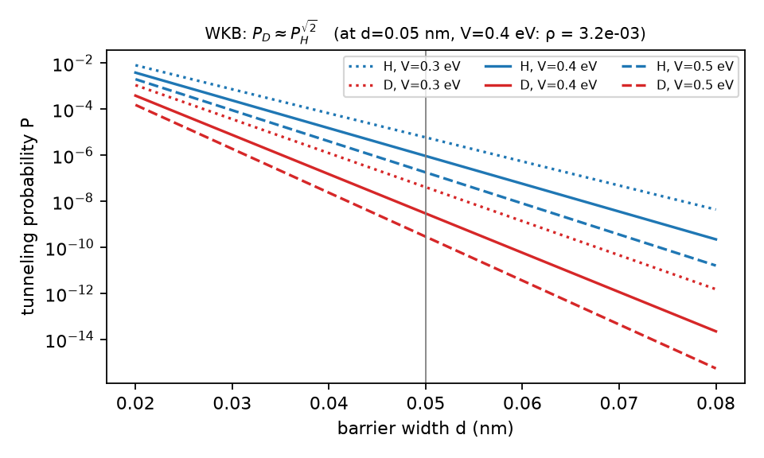
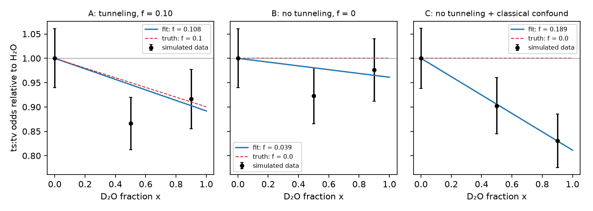
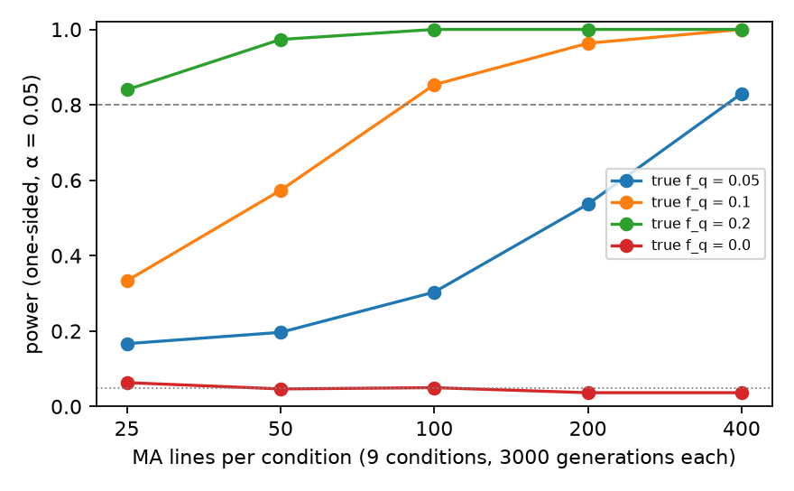
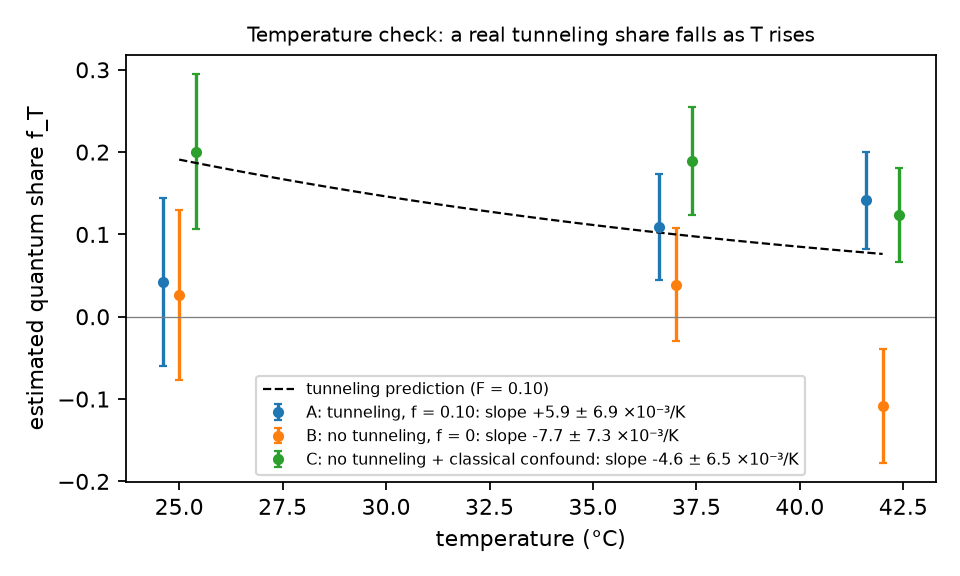

## Aim and hypothesis

**Question.** What fraction $f_q$ of spontaneous transition mutations arises from
proton tunneling between paired DNA bases?

**Hypothesis (H1).** $f_q > 0$: some transitions arise when a proton tunnels
across a base-pair hydrogen bond, creating a rare tautomer that mispairs during
replication [1, 2].

**Null (H0).** $f_q = 0$: transitions arise only from classical processes.

**Core prediction.** Replacing hydrogen with deuterium suppresses tunneling by a
factor $\rho = P_D / P_H \approx P_H^{\sqrt{2}-1}$, which is close to zero for
any realistic barrier. It does not suppress classical processes by anywhere near
as much. If a fraction $x$ of the relevant protons is deuterium, the quantum
contribution scales as $(1 - x + x\rho)$, so **the share of transitions should
drop by about $f_q \cdot x$** relative to a control class of mutations that
tautomers do not produce.

## Why the design works

Three facts make this experiment feasible.

1. **Heavy water deuterates exactly the right protons.** The protons in base-pair
   hydrogen bonds (the imino and amino N–H protons) exchange with the
   surrounding water within milliseconds to seconds. Cells grown in a medium
   with D₂O fraction $x$ therefore carry deuterium at about a fraction $x$ of
   those positions, at the moment of replication.
2. **Tautomers cause transitions, not transversions.** A rare tautomer of G pairs
   with T, and a rare tautomer of A pairs with C. Both lead to **transitions**
   (G·C ↔ A·T). **Transversions** come from other chemistry (oxidative damage,
   other mispairs) and serve as an internal control.
3. **Ratios cancel the nuisances.** Heavy water slows growth and may change
   overall mutation rates through ordinary chemistry: polymerase speed,
   proofreading and nucleotide pools. These effects act on both mutation
   classes. They cancel in the ratio of transitions to transversions, as do any
   errors in counting generations. Within one condition $(x, T)$:

$$\text{odds}(x, T) = \frac{\text{transitions}}{\text{transversions}} = \theta_T \cdot h(x), \qquad h(x) = 1 - f_T\, x\, (1 - \rho).$$

The baseline $\theta_T$ is free for each temperature, so the only quantity
linking the conditions is $f_T$, the quantum share at temperature $T$.

## Materials and design

### Organism and strain

*Escherichia coli* K-12 MG1655 with a deletion of **mutL**, a mismatch-repair
gene. In wild-type cells, mismatch repair removes most replication errors,
including tautomer-induced mispairs, before they become mutations. Without it,
the replication error spectrum is visible directly. MutL-deficient
mutation-accumulation lines are dominated by transitions and have been
characterized by whole-genome sequencing [3].

Expected rates in H₂O at 37 °C (used in the simulation): about $0.035$
transitions and $0.002$ transversions per genome per generation.

### Conditions

| Factor | Levels | Reason |
|---|---|---|
| D₂O fraction $x$ | 0, 0.5, 0.9 | The ends carry most of the information; 0.5 tests the shape of the response |
| Temperature | 25, 37, 42 °C | Tunneling is temperature-independent; classical chemistry is not |
| Lines per condition | 100 | From the power analysis below |
| Generations per line | 3,000 | Gives about 600 transversions per condition, the limiting count |

That is $3 \times 3 = 9$ conditions and **900 lines in total**. Media and agar
are prepared with the stated fraction of 99.9% D₂O. D₂O is the main
consumable cost, so plate volume should be minimized (small plates or multi-well
formats).

### Procedure

1. **Founding.** Streak the ancestral mutL strain from a single colony. Freeze
   the ancestor, then found every line from one colony of it.
2. **Bottlenecking.** Every day, pick one random colony per line (the colony
   nearest a pre-marked point, to avoid choosing by size) and streak it onto a
   fresh plate of the same condition. Single-cell bottlenecks make natural
   selection negligible, so almost every mutation is kept regardless of its
   effect.
3. **Counting generations.** About every 10 transfers, suspend whole colonies
   from a sample of lines and count cells. Generations per transfer are
   $\log_2(\text{cells per colony})$, typically 25–28. Heavy water and low
   temperature slow growth, so they need more days but not more transfers per
   generation. Generation counts only affect the secondary temperature analysis,
   because they cancel in the primary ratio.
4. **Freezing.** Freeze every line every 20 transfers as a backup.
5. **Duration.** About 110–120 transfers reach 3,000 generations: roughly four
   months at 37 °C in H₂O, longer in D₂O and at 25 °C.
6. **Sequencing.** Extract genomic DNA from the final population of each line and
   the ancestor. Sequence with Illumina at 50× coverage or more, call variants
   against the ancestor (for example with *breseq*), and discard any variant
   present in more than one line (ancestral or contamination).
7. **Classification.** Classify each single-base substitution as a transition or
   a transversion. Record its sequence context for secondary analyses. Indels
   are excluded from the primary analysis.

### Pre-registered analysis

- **Primary test:** one $f_q$ shared across temperatures, with a free baseline
  $\theta_T$ at each temperature, fitted by maximum likelihood on the binomial
  split of mutations into transitions and transversions. H0 ($f_q = 0$) is tested
  with a one-sided signed-root likelihood-ratio statistic, $z = \operatorname{sign}(\hat f)\sqrt{2\Delta\ell/\hat\phi}$,
  where $\hat\phi$ is the overdispersion estimated from line-level Pearson
  residuals. Reject H0 at $z > 1.645$.
- **Secondary, temperature check:** fit $f_T$ separately at each temperature.
  Because tunneling does not speed up with temperature while classical
  mutation does, a real quantum share must **fall** with temperature:

$$f_T = \frac{F}{F + (1 - F)\, e^{-\frac{E_a}{k_B}\left(\frac{1}{T} - \frac{1}{T_{\text{ref}}}\right)}},$$

  where $E_a$ is measured from the absolute transversion rates in H₂O.
- **Reported in all cases:** $\hat f_q$ with a 95% confidence interval, so that a
  null result still sets an **upper bound** on the quantum share.

## Simulation

The whole experiment is simulated in `heavy_water/simulate.py`. The program:

1. computes the tunneling probabilities $P_H$ and $P_D$ from the WKB formula;
2. generates mutation counts for every line from a model with classical and
   quantum components, including Arrhenius temperature dependence for the
   classical part, a classical isotope effect shared by all mutations, 10%
   line-to-line rate variation and 3% error in generation counts;
3. runs the pre-registered analysis on the simulated data; and
4. repeats the whole experiment 300 times per design to estimate power and
   false-positive rate.

All biological parameters are illustrative, chosen from the published range
for mutL *E. coli* [3]. The barrier height (0.40 eV) and width (0.05 nm) are
illustrative too. The design is insensitive to them, because $\rho$ is close to
zero for any realistic barrier.

### Tunneling physics



For the reference barrier, $P_H = 9.3 \times 10^{-7}$ and $P_D = 3.0 \times
10^{-9}$, so $\rho = 3.2 \times 10^{-3}$: deuterium tunnels about 300 times
less often. At $x = 0.9$, the tunneling contribution therefore falls to about
10% of its H₂O value.

### Three simulated worlds

Each scenario is one complete simulated run of the 900-line experiment.

| Scenario | Truth | Estimate $\hat f_q$ | $z$ | Verdict |
|---|---|---|---|---|
| A: tunneling | $f_q = 0.10$ | $0.114 \pm 0.039$ | 2.80 | Detected, close to the truth |
| B: no tunneling | $f_q = 0$ | $-0.031 \pm 0.044$ | −0.71 | Correctly not detected |
| C: classical confound | $f_q = 0$, plus a transition-specific classical isotope effect | $0.160 \pm 0.039$ | 3.76 | **False detection** |



### Power

| Lines per condition | 25 | 50 | 100 | 200 | 400 |
|---|---|---|---|---|---|
| $f_q = 0.20$ | 0.84 | 0.97 | 1.00 | 1.00 | 1.00 |
| $f_q = 0.10$ | 0.33 | 0.57 | **0.85** | 0.96 | 1.00 |
| $f_q = 0.05$ | 0.17 | 0.20 | 0.30 | 0.54 | 0.83 |
| $f_q = 0$ (false positives) | 0.06 | 0.05 | 0.05 | 0.04 | 0.04 |

*300 simulated experiments per cell; one-sided test at the 5% level.*



The test is **calibrated**: when there is no tunneling, it reports a detection
about 5% of the time, as it should. With 100 lines per condition, a 10% quantum
share is detected 85% of the time and a 20% share almost always. A 5% share
needs about 400 lines per condition. The limiting factor throughout is the
number of transversions, the control class, which are about 17 times rarer than
transitions in mutL cells.

An earlier version of the design, with five D₂O levels, 40 lines and 1,000
generations, had an uncertainty of about ±0.10, as large as the effect itself.
Concentrating lines at the ends of the D₂O range and running three times as
many generations cut the uncertainty by more than half.

### The confound, and why temperature alone cannot catch it

Scenario C is the main threat to the experiment. If heavy water slows the
**classical** chemistry of transitions more than that of transversions (for
example through a zero-point-energy effect on over-the-barrier tautomerization),
the transition share drops even with no tunneling at all. The primary test
cannot tell the two apart.

In principle, temperature can. A tunneling share falls as temperature rises; a
classical one stays roughly flat. The simulation shows that the signal is too
weak at this scale:

| Scenario | Observed slope $df_T/dT$ ($\times10^{-3}$/K) | Tunneling would predict |
|---|---|---|
| A: tunneling | $+5.9 \pm 6.9$ | $-5.9$ |
| B: no tunneling | $-7.7 \pm 7.3$ | 0 |
| C: classical confound | $-4.6 \pm 6.5$ | $-9.3$ |



The uncertainty (about $\pm 7 \times 10^{-3}$/K) is as large as the effect, so
the temperature arm cannot separate scenario A from scenario C. The 25–42 °C
range is too narrow, because living *E. coli* cannot be grown much outside it.

### Resolving the confound: an in vitro companion experiment

The established way to identify tunneling in chemistry and enzymology is the
**temperature dependence of the kinetic isotope effect** over a wide range,
which is easy in a test tube and impossible in living cells. The companion
experiment:

1. Measure single-turnover misincorporation kinetics (G·T and A·C mispair
   formation) for purified *E. coli* DNA polymerase III, or a model polymerase,
   in H₂O and D₂O buffers from 5 to 50 °C.
2. Fit Arrhenius plots for both isotopes. Tunneling is indicated by the standard
   criteria: a large isotope effect (above about 7 at 25 °C), an
   isotope-dependent activation energy difference larger than the zero-point
   energy limit, and a ratio of Arrhenius prefactors $A_H / A_D$ outside the
   semiclassical range of about 0.7–1.2 [4].
3. Run the same assay on transversion-forming mispairs as a control.

## Interpreting the outcomes

| In vivo result | In vitro tunneling criteria | Conclusion |
|---|---|---|
| No transition-specific drop ($z < 1.645$) | Any | $f_q$ is below the measured 95% upper bound; tunneling is not a major mutation source |
| Significant drop | Met | Evidence that a fraction $\hat f_q$ of mutation is quantum in origin |
| Significant drop | Not met | A classical, transition-specific isotope effect; no evidence for tunneling |

Every outcome is informative. Even a null result is new: the first direct
experimental upper bound on how much of spontaneous mutation comes from proton
tunneling.

## Limitations

- **Illustrative parameters.** The rates, activation energy and isotope-effect
  energies in the simulation are plausible but not measured for these exact
  conditions. A small pilot (for example 20 lines per condition for 500
  generations) should be used to re-estimate them and re-run the power analysis
  before the full experiment.
- **Proton inventory.** The model assumes the tunneling contribution falls
  linearly with $x$. If tautomers form by concerted transfer of two protons, the
  dependence may be closer to $(1 - x)^2$. The $x = 0.5$ level allows this to be
  checked, and the analysis can be refitted with either form.
- **Heavy water as a stressor.** High D₂O fractions slow growth and may trigger
  stress responses that change mutation rates. The transversion control absorbs
  effects shared by both classes, but stress-induced mutagenesis with a
  transition bias would act as another confound. It is addressed by the same in
  vitro companion experiment.
- **Scale and cost.** 900 lines for four months or more, and the cost of D₂O
  media, make this a substantial project. The power analysis shows the scale is
  needed; a smaller experiment could only detect a quantum share of 20% or more.

## Reproducing the simulation

```
python heavy_water/simulate.py           # full run, a few minutes
python heavy_water/simulate.py --quick   # fewer power-analysis repeats
```

The program writes the four figures and `results.json` (all numbers above) to
the `heavy_water/` folder. It uses NumPy, SciPy and Matplotlib.

## References

1. Löwdin, P.-O. (1963). Proton tunneling in DNA and its biological implications. *Reviews of Modern Physics*, 35(3), 724–732.
2. Slocombe, L., Sacchi, M., & Al-Khalili, J. (2022). An open quantum systems approach to proton tunnelling in DNA. *Communications Physics*, 5, 109.
3. Lee, H., Popodi, E., Tang, H., & Foster, P. L. (2012). Rate and molecular spectrum of spontaneous mutations in the bacterium *Escherichia coli* as determined by whole-genome sequencing. *PNAS*, 109(41), E2774–E2783.
4. Klinman, J. P., & Kohen, A. (2013). Hydrogen tunneling links protein dynamics to enzyme catalysis. *Annual Review of Biochemistry*, 82, 471–496.
